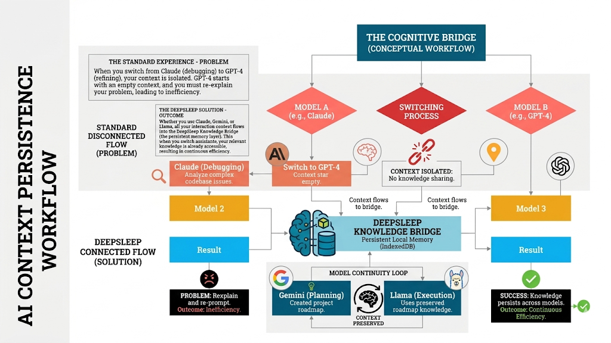
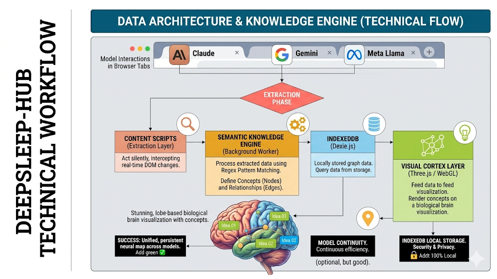
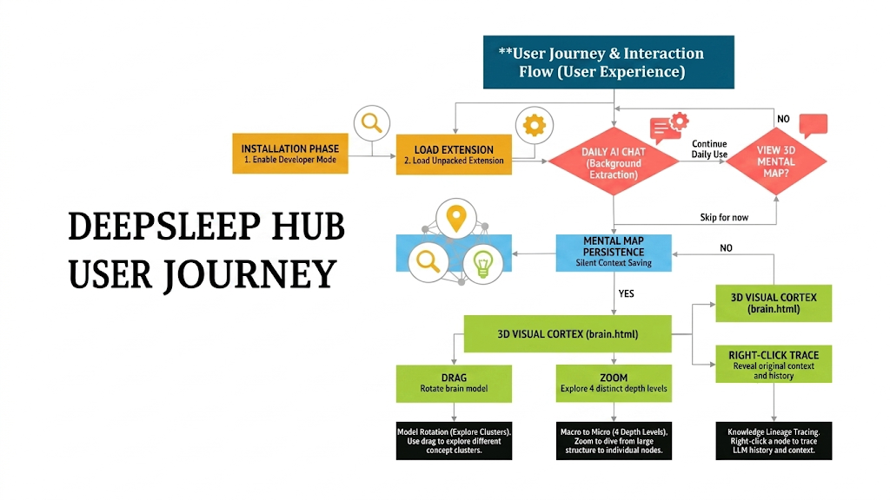

# DeepSleep-Hub (v4.0)

# Stop Forgetting your AI's Intelligence.
### The first cinematic 3D memory layer for ChatGPT, Claude, and Gemini.

## 🚀 NEW: Neural Injection (Zero-Copy Interconnectivity)
DeepSleep v2.3 introduces **Zero-Copy Injection**. You no longer need to copy/paste history manually. 
*   **The Brain Widget**: A small, floating 🧠 brain icon now appears inside every AI chat window.
*   **One-Click Context**: Click the brain to see your most recent memories from *other* AIs (e.g. bridging a Claude session into ChatGPT).
*   **Instant Injection**: Click any memory to instantly inject it directly into your current chat box. 

---

> [!CAUTION]
> **DEVELOPER MODE REQUIRED**: This extension is a high-octane experimental memory engine. It is **NOT** in the Google Chrome Web Store. You must install it via the "Load Unpacked" method.

## 🧠 Why DeepSleep-Hub?
Assistants change. Your context shouldn't. DeepSleep-Hub unifies every AI interaction into a single, pulsing biological map. It’s not just an extension; it’s a **Second Brain with Chromatic Aberration.**

## 🚀 New in v2.4: Zero-Copy Autorecall
We have completely re-engineered the core for industrial-strength reliability:
- **IndexedDB Reliability (Dexie.js)**: Full schema versioning and ACID transactions.
- **Quota Management**: Proactive storage monitoring with LRU eviction to prevent browser crashes.
- **MV3 Lifecycle Persistence**: Service Worker pulse-checks ensure the memory layer never sleeps.
- **Message Batching**: Debounced thought-capture prevents browser messaging overhead even during rapid chats.
- **Offline-First**: Zero external dependencies. All 3D assets and libraries are bundled locally.

## 🔥 Join the Collective
We are looking for cinematic builders to help us evolve the Visual Cortex. 
[Read the Contributing Guide](./CONTRIBUTING.md) to start forking and building.

**Assistants change. Your context doesn't.**

DeepSleep-Hub is a coordinate-free, cinematic knowledge bridge that ensures your AI mental map persists across **ChatGPT, Claude, Gemini, and Local Llama**. It acts as the "connective tissue" for your digital intelligence—so when you switch from debugging with Claude to local reasoning with Llama, your neural interface already holds the relevant codebase context.

## 🚀 Quickstart: Installation

Because DeepSleep-Hub is a coordinate-free memory engine, it is currently deployed as a **Developer Mode** extension. It is NOT in the Chrome Web Store yet.

### 1. Enable Developer Mode
1. Download the latest production build: [**DeepSleep-Hub-v4.0.zip**](https://github.com/Keshavsharma-code/deepsleep-hub/raw/main/DeepSleep-Hub-v4.0.zip).
2. Open Google Chrome (or any Chromium browser like Brave/Edge).
3. Type `chrome://extensions/` in the address bar and hit Enter.
4. In the top-right corner, toggle **Developer mode** to **ON**.

### 2. Load the Engine
1. Click the **Load unpacked** button (top left).
2. Navigate to your local folder where this code is stored.
3. Select the `deepsleep-hub` folder and click **Open**.
4. You should now see the `DeepSleep Hub` card appear in your extensions list.

### 3. Open your Visual Cortex
1. Click the **Puzzle Piece** icon in the Chrome toolbar.
2. Click the **DeepSleep Hub** icon.
3. In the popup that appears, click **"Enter Semantic Visualization"**.
4. This will launch the 3D Brain interface into a new tab. Done.

### 4. How to Confirm it's Working
Once installed, you can verify the connection in 3 seconds:
*   **The Toolbar**: You will see the glowing brain icon in your browser's extensions bar.
*   **The Initialization**: Open the brain interface. You should see a single golden node at the core saying **"Neural mesh initialized"**.
*   **The Pulse**: Type anything into ChatGPT. If you see a subtle green border appear on your AI response, the DeepSleep scout has successfully captured the thought.

---

## ⛓️ The DeepSleep Memory Bridge
AIs are sandboxed—Kimi cannot see Claude, and Claude cannot see ChatGPT. **DeepSleep Hub is the missing link.**

### How to share knowledge between AIs:
1.  **Capture**: Chat with any AI. DeepSleep captures the "Thought" automatically.
2.  **Select**: Open the DeepSleep Popup or the 3D Neural Mesh.
3.  **Bridge**: Click the **"COPY TO CLIPBOARD"** button on any recent memory.
4.  **Inject**: Paste that formatted memory into your other AI. 
    > *Example: "Hey Claude, here is a memory from my GPT-4 session: [Pasted Context]"*

---

## 🛠 Troubleshooting & FAQs

If the brain doesn't look like the screenshots, check these "Fixes" first:

### 1. "I only see a black screen"
*   **The Fix**: This usually happens if a Browser Extenson (like uBlock Origin) is blocking the Three.js CDN. 
*   **Action**: Ensure you have an internet connection and have no "Script Blockers" preventing `jsdelivr.net` from loading. In v1.3+, the brain will automatically try a "Safe Boot" to bypass this.

### 2. "The Brain is empty / No nodes appearing"
*   **The Fix**: This is intended! The brain starts empty because it hasn't learned from you yet.
*   **Action**: Go to ChatGPT or Claude and start a conversation. As soon as the AI replies, the brain will capture the "Knowledge Extract" and show a new node in real-time.

### 3. "Everything disappeared! Where is my brain?"
*   **The Fix**: You are likely in **Zen Mode**.
*   **Action**: Press the **`Z`** key on your keyboard to toggle the UI visibility. This allows for a pure, cinematic view of the neural mesh.

### 4. "Buttons are not working"
*   **The Fix**: This happens if the extension context is lost.
*   **Action**: Refresh the `brain.html` tab. Ensure you loaded the folder via "Load Unpacked" and didn't just open the file directly from your desktop.

---

## 🧪 Simulation Mode (No AI Required)
If you want to see the 3D biological visualizations without having to chat with a real LLM:
1. Load the extension as shown above.
2. Open [`test.html`](file:///Users/keshavsharma/basalt/deepsleep-hub/test.html) in your browser.
3. Open the **Semantic Visualization** (`brain.html`) in a second tab.
4. Keep both tabs visible. Click the **"Generate Fake AI Thoughts"** buttons.

---

## 📖 How to Use

Once the extension is loaded, the engine works **automatically**. You don't need to manually sync anything.

1.  **Chat Normally**: Go to ChatGPT, Claude, or Gemini and talk to your AI assistants. 
2.  **Open the Cortex**: Click the DeepSleep icon in your toolbar and select **"Enter Semantic Visualization"**.
3.  **Explore the Brain**:
    *   **Drag**: Rotate the biological model.
    *   **Scroll**: Zoom through 4 levels of depth.
    *   **Trace (Right-Click)**: Right-click any node to reveal the exact context and LLM history.
4.  **Model Continuity**: Source concepts persist across assistants!

---

🔗 **DeepSleep Ecosystem**: For those seeking the full atmospheric experience, also use [DeepSleep-beta](https://github.com/Keshavsharma-code/DeepSleep-beta) for Dream Mode synthesis.

---

## 🔒 Privacy & Safety
- **100% Local**: All data is stored in your browser's IndexedDB. 
- **No External Servers**: Your chat history never leaves your machine.
- **Model Agnostic**: Works across any supported LLM platform.
